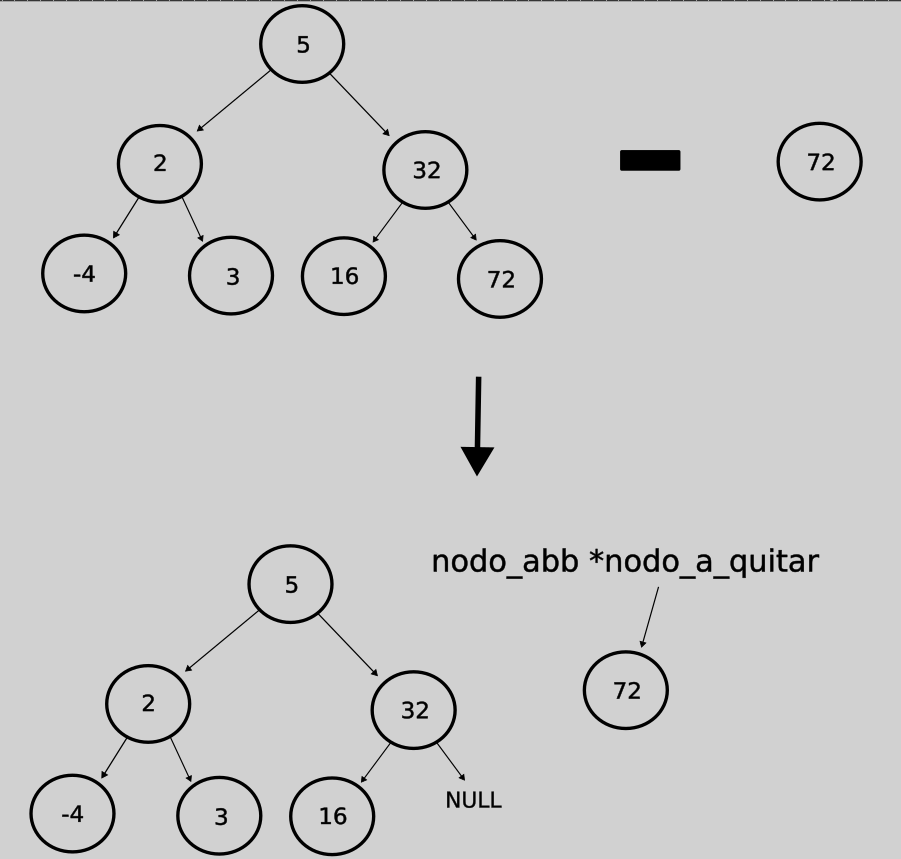

# TDA ABB

- Para compilar:

```bash
gcc src/*.c pruebas.c -o pruebas
```

- Para ejecutar:

```bash
./pruebas
```

- Para ejecutar con valgrind:
```bash
valgrind ./pruebas
```
---

##  Explicación teórica de árboles (generales, binarios y binarios de búsqueda)

### Árboles generales o n-arios

En general, un árbol es una colección de nodos que están conectados entre sí de forma tal que se van "ramificando". Cada nodo tiene un padre y puede tener varios hijos (la cantidad máxima de hijos que puede tener un nodo define el tipo de árbol; en uno binario, por ejemplo, cada nodo puede tener hasta dos hijos). Hay un nodo que se distingue de los demás por ser el primer nodo del árbol, y lo llamamos raíz. 

De esta manera, podemos definir a un árbol de manera recursiva: pensando a un nodo con sus hijos como un sub-árbol del árbol principal que es la raiz y sus hijos. Es decir que son árboles que se unen a otros árboles, recursivamente.

<div align="center">

</div>

#### Inserción

Como no tiene un criterio claro para ordenar los nodos (ya veremos eso en los árboles binarios de búsqueda), si queremos insertar un nodo al árbol va a depender del criterio del mismo. Aún así, en general, para insertar debemos recorrer una rama del árbol a partir del nodo raíz (raíz->un hijo->uno de los hijos de este->etc.) hasta llegar a un nodo que no tenga sus hijos completos, y ahí hacemos que uno de sus hijos libres sea el nodo a insertar. Como lo que estamos haciendo es recorrer una de las ramas del árbol, la complejidad computacional de esta operación es O(log(N)). 

Aunque esto no es siempre así: un árbol podría convertirse en una lista enlazada, ya que si siempre insertamos elementos en la misma rama del árbol, termina perdiendo la "forma" de árbol y se convierte en una lista. En este caso, todas las operaciones pasan a tener la misma complejidad que si las implementáramos a una lista enlazada, en el caso de la inserción, sería O(N), porque recorremos el árbol completo, ya que tiene una sola rama.

Las demás operaciones básicas, como quitar o buscar un elemento, o recorrer el árbol, dependen totalmente del criterio de orden del mismo y la cantidad máxima de hijos que puede tener cada nodo, por lo que vamos a analizarlas en los apartados de árbol binario y árbol binario de búsqueda. 

### Árboles binarios

Los árboles binarios, como su nombre lo indica, son árboles cuyos nodos tienen como máximo dos hijos. Esto nos da una ventaja muy importante para buscar elementos dentro del árbol, ya que tenemos la noción de hijo derecho e hijo izquierdo, por lo que podemos "movernos" más fácilmente por el árbol.

<div align="center">

</div>

#### Recorrido

Si "nos paramos" en la raíz y queremos recorrer todo el árbol, tenemos varias formas de hacerlo.

Nombrando al nodo actual, en el que "estamos parados" como N, su hijo izquierdo como I y el derecho como D, tenemos seis formas de recorrer estos tres nodos, que podemos tomar como un sub-árbol de un árbol mayor:

_NID IND IDN NDI DNI DIN_

Si, por ejemplo, queremos recorrer un árbol e ir guardando sus elementos en una lista, N sería guardar el nodo actual en la lista, I sería movernos al nodo izquierdo, y D al nodo derecho.

De las seis combinaciones posibles, existen tres que son estándares:

_NID IND IDN_

- __NID: Preorden__. Primero guardamos el nodo actual en la lista, luego nos movemos al nodo izquierdo, y luego al derecho. Obviamente se va aplicando recursivamente, es decir que al visitar el nodo izquierdo el recorrido se reinicia: guardamos ese nodo en la lista, y luego vamos a su hijo izquierdo, etc.

<div align="center">

</div>

Si queremos implementar este recorrido invocando a una función con cada elemento de la lista, donde esta función pueda devolver un booleano y si es false corta el recorrido, lo podemos hacer de manera muy sencilla con recursividad, haciendo las llamadas recursivas al final de la función (primero con el hijo izquierdo y luego con el derecho), luego de invocar la otra función con el elemento del nodo actual, para respetar el orden del recorrido.

```c
	if (!nodo_actual)
		return true;
	if (funcion(nodo_actual->elemento, aux) == false)
		return false;
	if (abb_recorrer_preorden(nodo_actual->izquierda, funcion, aux, i) ==
	    false)
		return false;
	return abb_recorrer_preorden(nodo_actual->derecha, funcion, aux, i);
```

- __IND: Inorden__. Primero vamos al hijo izquierdo, luego guardamos el nodo actual, y luego vamos al derecho.

<div align="center">

</div>

En este caso, para implementar el recorrido, hacemos la llamada a la función externa con el elemento del nodo actual entre medio de las llamadas recursivas (primero con el hijo izquierdo y luego con el derecho).

```c
	if (!nodo_actual)
		return true;
	if (abb_recorrer_inorden(nodo_actual->izquierda, funcion, aux, i) ==
	    false)
		return false;
	if (funcion(nodo_actual->elemento, aux) == false)
		return false;
	return abb_recorrer_inorden(nodo_actual->derecha, funcion, aux, i);
```

- __IDN: Postorden__. Primero vamos al hijo izquierdo, luego al derecho, y por último guardamos el nodo actual en la lista.

<div align="center">

</div>

Para implementar este recorrido, hacemos la llamada a la función externa con el elemento del nodo actual al final, luego de hacer las llamadas recursivas (primero con el hijo izquierdo y luego con el derecho).

```c
	if (!nodo_actual)
		return true;
	if (abb_recorrer_postorden(nodo_actual->izquierda, funcion, aux, i) ==
	    false)
		return false;
	if (abb_recorrer_postorden(nodo_actual->derecha, funcion, aux, i) ==
	    false)
		return false;
	return funcion(nodo_actual->elemento, aux);
```

Obviamente, como recorremos el árbol entero, el recorrido es una operación de complejidad O(N).

Las operaciones de búsqueda y de eliminación dependen mucho del criterio de orden que tienen los nodos del árbol, por lo que vamos a verlas con el árbol binario de búsqueda.

### Árbol binario de búsqueda

Como señala su nombre, es un árbol binario, pero con una gran distinción: el hijo derecho siempre es mayor que el padre, y el izquierdo siempre es menor.

Por ejemplo, si tengo un árbol que tiene como raíz el número 3, si quiero insertar el número 2, lo pondría como hijo izquierdo, y si quiero insertar el 5, iría como hijo derecho de la raíz. Luego si quiero insertar el 8, iría como hijo derecho del 5.

<div align="center">

</div>

#### Búsqueda

Al tener un criterio de orden se hace muy fácil buscar un elemento, simplemente comenzamos por la raíz y comparamos ambos elementos: si son iguales entonces hemos encontrado el elemento. Si el buscado es mayor nos movemos hacia la derecha, y si es menor hacia la izquierda. Si llegamos a un nodo nulo es porque el elemento no se encuentra en el árbol.

Es muy fácil implementar esta operación recursivamente, con dos casos base o de corte: uno donde el nodo actual es nulo (devolvemos NULL), y otro donde los elementos son iguales (devolvemos el elemento del nodo actual). En los casos donde no son iguales llamamos recursivamente a la función pasando el hijo derecho o izquierdo según corresponda.

```c
	if (!nodo_actual)
		return NULL;
	else if (comparador(nodo_actual->elemento, elemento) == 0)
		return nodo_actual->elemento;
	else if (comparador(nodo_actual->elemento, elemento) < 0)
		return abb_buscar_recu(nodo_actual->derecha, elemento,
				       comparador);
	else
		return abb_buscar_recu(nodo_actual->izquierda, elemento,
				       comparador);
```

Como vemos, siempre recorremos una de las ramas del árbol en la búsqueda, por lo que la complejidad computacional de la misma es O(log(N)), u O(N) si el árbol se degrada a una lista enlazada.

#### Eliminación

Al eliminar un nodo, nos encontramos con tres casos, que el nodo a eliminar no tenga hijos (se denominan nodos hoja), que tenga un hijo o que tenga dos.

__Quitar nodo hoja:__

Este es el caso más sencillo para implementar, ya que simplemente hay que hacer que el padre apunte a NULL en esa posición. Obviamente antes debemos apuntar al nodo a eliminar con un puntero auxiliar para no perder memoria y luego liberar este nodo o hacer lo que queramos con él. 

Si el nodo fuera la raíz, es decir si quisiéramos eliminar la raíz de un árbol de tamaño 1, habría que hacer que la raíz del arbol apuntara a NULL, teniendo en cuenta que la estructura del abb es

```c
struct abb {
	nodo_abb_t *nodo_raiz;
	abb_comparador comparador;
	size_t tamanio;
};
```

<div align="center">

</div>

__Quitar nodo con un hijo:__

Este caso también es bastante simple, solo debemos hacer que el padre del nodo a eliminar, en vez de apuntar a este nodo, apunte a su único hijo (luego de referenciarlo con un puntero auxiliar).

Si el nodo a eliminar fuera la raíz, sería lo mismo pero cambiando la referencia del nodo_raíz del abb al hijo de la raíz.

<div align="center">

</div>

__Quitar nodo con dos hijos:__

Este es el caso más complejo. Para eliminar un nodo con dos hijos, debemos reemplazar el nodo a quitar con su predecesor o sucesor inorden. En este caso se implementó con el predecesor. El predecesor inorden es el elemento inmediatamente menor al que se quiere quitar. Para llegar al mismo debemos, a partir del nodo a quitar, ir al hijo izquierdo, y luego ir hacia la derecha hasta el final de la rama. Cuando reemplazamos el elemento, eliminamos el nodo predecesor, que es un nodo hoja o con un hijo. Al hacer esto seguimos respetando el orden del arbol binario de búsqueda. 

<div align="center">

</div>

## Decisiones de diseño e implementación:

Todas las operaciones principales (inserción, búsqueda, eliminación y recorrido) las hice recursivamente porque me pareció mucho más simple para pensarlo e implementarlo, ya que, como expliqué anteriormente, el árbol tiene una naturaleza recursiva, y es ideal para ir llamando recursivamente a las funciones con los distintos hijos de cada nodo.

### Inserción

Lo que más se me complicó al implementar la inserción fue el tema de los punteros a los nodos, ya que trabajé con puntero doble, porque para insertar justamente se debe modificar un puntero del nodo para agregarle un hijo.

Por otro lado, no hice las llamadas recursivas dentro de la misma función abb_insertar, sino que hice una llamada a otra función recursiva donde pasé un puntero al nodo raíz del árbol. Lo hice así porque me pareció más claro y simple para implementar.

```c
void abb_insertar_recu(struct nodo_abb **nodo_actual, void *elemento,
		       abb_comparador comparador)
{
	if (!(*nodo_actual)) {
		*nodo_actual = crear_nodo(elemento);
		return;
	}
	if (comparador((*nodo_actual)->elemento, elemento) >= 0)
		abb_insertar_recu(&((*nodo_actual)->izquierda), elemento,
				  comparador);
	else
		abb_insertar_recu(&((*nodo_actual)->derecha), elemento,
				  comparador);
}
```

### Búsqueda

Ya me referí a la implementación de esta operación más arriba. No tuve ningún inconveniente, y también decidí llamar a una función recursiva en abb_buscar en vez de hacer la recursividad en la misma función.

### Eliminación

Quitar un nodo fue definitivamente lo más complicado de implementar, ya que había muchos casos distintos, uno para nodo hoja, otro para nodo con un hijo y otro para uno con dos, y por cada uno de estos tres dependía de si se quería eliminar la raíz u otro nodo.

Si el nodo a eliminar no era la raíz, utilicé una función recursiva que iba recorriendo hasta llegar al padre del nodo a eliminar, y llamaba a otra función (quitar_un_hijo) donde pasaba el arbol, el padre, el elemento a quitar, y un int posición que era 0 o 1: 0 si el hijo a eliminar era el izquierdo o 1 si era el derecho.

```c
	if (!nodo_actual) {
		return NULL;
	} else if (nodo_actual->derecha &&
		   comparador(nodo_actual->derecha->elemento, elemento) == 0) {
		return quitar_un_hijo(arbol, nodo_actual, elemento, 1);
	} else if (nodo_actual->izquierda &&
		   comparador(nodo_actual->izquierda->elemento, elemento) ==
			   0) {
		return quitar_un_hijo(arbol, nodo_actual, elemento, 0);
	} else if (comparador(nodo_actual->elemento, elemento) > 0) {
		return abb_quitar_recu(arbol, nodo_actual->izquierda, elemento,
				       comparador);
	} else {
		return abb_quitar_recu(arbol, nodo_actual->derecha, elemento,
				       comparador);
	}
```

Dentro de la función quitar_un_hijo, primero creé un puntero auxiliar al nodo a quitar, y dependiendo de la cantidad de hijos de este nodo llamé a la función correspondiente.

Para quitar un nodo hoja, pasaba la posición del hijo a quitar (0 o 1), y dependiendo de eso seteaba el hijo del padre en NULL, y luego liberaba el puntero auxiliar.

```c
void quitar_hijo_sin_hijos(struct nodo_abb *nodo_padre,
			   struct nodo_abb *nodo_a_quitar, int posicion)
{
	if (posicion == 0)
		nodo_padre->izquierda = NULL;
	else
		nodo_padre->derecha = NULL;
	free(nodo_a_quitar);
}
```

Para quitar un hijo que tenía a su vez un hijo, utilicé los mismos parámetros y dependiendo de cuál era el hijo que tenía el nodo a quitar, seteaba el hijo del padre. Luego liberaba el puntero auxiliar.

```c
void quitar_hijo_con_un_hijo(struct nodo_abb *nodo_padre,
			     struct nodo_abb *nodo_a_quitar, int posicion)
{
	if (posicion == 0) {
		if (nodo_a_quitar->derecha)
			nodo_padre->izquierda = nodo_a_quitar->derecha;
		else
			nodo_padre->izquierda = nodo_a_quitar->izquierda;
	} else {
		if (nodo_a_quitar->derecha)
			nodo_padre->derecha = nodo_a_quitar->derecha;
		else
			nodo_padre->derecha = nodo_a_quitar->izquierda;
	}
	free(nodo_a_quitar);
}
```

Por último, si el nodo a quitar tenía dos hijos, primero buscaba su predecesor inorden. Si el hijo izquierdo del nodo tenía a su vez hijo derecho, pasaba el nodo a la función quitar_predecesor_a_derecha, dentro de la cual primero buscaba el padre del predecesor con la función buscar_predecesor_inorden, la cual recorría recursivamente la rama del hijo derecho del hijo izquierdo del nodo a quitar hasta que el hijo derecho del nodo actual no tuviera a su vez hijo derecho. Básicamente sería esto:

```c
void *quitar_predecesor_a_derecha(struct nodo_abb *nodo_actual)
{
	struct nodo_abb *nodo_padre_del_predecesor =
		buscar_predecesor_inorden(nodo_actual->izquierda);
	struct nodo_abb *nodo_predecesor = nodo_padre_del_predecesor->derecha;
	void *elemento_predecesor = nodo_predecesor->elemento;
	...
}

struct nodo_abb *buscar_predecesor_inorden(struct nodo_abb *nodo_actual)
{
	if (!nodo_actual->derecha->derecha) {
		return nodo_actual;
	}
	return buscar_predecesor_inorden(nodo_actual->derecha);
}
```
Luego, teniendo el nodo predecesor inorden, como sabía que tiene como máximo un hijo, utilizaba las funciones quitar_hijo_sin_hijos o quitar_hijo_con_un_hijo segun corresponda para quitar ese nodo, y devolvía su elemento.

En cambio, si el hijo izquierdo del nodo a quitar no tenía hijo derecho, era mucho más simple, solo debía quitar el hijo izquierdo y devolver su elemento.

```c
void *quitar_hijo_izquierda(struct nodo_abb *nodo_actual)
{
	void *elemento_predecesor = nodo_actual->izquierda->elemento;
	if (nodo_cantidad_hijos(nodo_actual->izquierda) == 0) {
		quitar_hijo_sin_hijos(nodo_actual, nodo_actual->izquierda, 0);
	} else {
		quitar_hijo_con_un_hijo(nodo_actual, nodo_actual->izquierda, 0);
	}
	return elemento_predecesor;
}
```

Por último, teniendo el elemento predecesor, lo reemplazaba en el nodo a quitar y listo.

```c
void quitar_hijo_con_dos_hijos(struct nodo_abb *nodo_a_quitar)
{
	void *elemento_predecesor = NULL;
	if (nodo_a_quitar->izquierda->derecha) {
		elemento_predecesor = quitar_predecesor_a_derecha(nodo_a_quitar);
	} else {
		elemento_predecesor = quitar_hijo_izquierda(nodo_a_quitar);
	}
	nodo_a_quitar->elemento = elemento_predecesor;
}
```

Ahora, si el nodo a quitar era la raíz, tenía de nuevo las tres posibilidades.

Si la raíz no tenía hijos, quiere decir que el árbol tenía tamaño 1. Por lo tanto, solamente debía liberar la raiz y cambiar la referencia de la raíz a NULL.

```c
	free(arbol->nodo_raiz);
	arbol->nodo_raiz = NULL;
	arbol->tamanio--;
	return elemento;
```

Si tenía un hijo, creaba una raíz auxiliar, un nodo cuyo hijo derecho era la raíz original del árbol, de manera tal que podía tratar a la raíz original como un nodo con un hijo, por lo que podía usar la función quitar_nodo_con_un_hijo para eliminarlo. Por último obviamente liberaba la raíz auxiliar.

```c
	struct nodo_abb *raiz_aux = crear_nodo(arbol->nodo_raiz->elemento);
	raiz_aux->derecha = arbol->nodo_raiz;
	quitar_hijo_con_un_hijo(raiz_aux, arbol->nodo_raiz, 1);
	arbol->nodo_raiz = raiz_aux->derecha;
	free(raiz_aux);
```

Por último, si la raíz tenía dos hijos, como lo único que cambiaba era el elemento de la raíz y no había que tocar la referencia al nodo raíz del abb, utilizaba la función quitar_hijo_con_dos_hijos y listo.

### Recorrer

Ya me referí a la implementación de los distintos recorridos más arriba. En cuanto a la función abb_recorrer que iba llenando un array con los elementos del abb, decidí reutilizar la función abb_con_cada_elemento pasando como parámetro aux un struct que tenía la información que necesitaba del array para irlo llenando: su tamaño, el array en sí, y el índice actual que iba aumentando en cada iteración para ir almacenando los elementos.

```c
struct estado_array {
	size_t tamanio_maximo;
	void **array;
	int indice;
};
```

Además del struct, pasaba como función agregar_elemento_al_array, que justamente iba agregando el elemento del nodo actual al array utilizando la información del struct para hacerlo. Si el índice era mayor o igual que el tamaño simplemente devolvía false, para cortar el recorrido.

```c
bool agregar_elemento_al_array(void *elemento, void *estado_array)
{
	int indice = ((struct estado_array *)estado_array)->indice;
	int tamanio = 
		    (int)((struct estado_array *)estado_array)->tamanio_maximo;
	if (indice >= tamanio)
		return false;
	(((struct estado_array *)estado_array)->array)[indice] = elemento;
	(((struct estado_array *)estado_array)->indice)++;
	return true;
}
```

### Destruir

Como siempre, decidí implementar la destrucción recursivamente, utilizando una función recursiva, la cual recibe la raiz del arbol y una función destructora, recorre el árbol de manera postorden, y si la función no es NULL la aplica con el elemento del nodo, y luego libera cada nodo.

```c
void abb_destruir_nodos(struct nodo_abb *nodo_actual,
			void (*destructor)(void *))
{
	if (!nodo_actual) {
		return;
	}
	abb_destruir_nodos(nodo_actual->izquierda, destructor);
	abb_destruir_nodos(nodo_actual->derecha, destructor);
	if (destructor) {
		destructor(nodo_actual->elemento);
	}
	free(nodo_actual);
}
```
Por último se libera el árbol. Obviamente en abb_destruir se invoca la función recursiva pasando NULL como función destructora, y en abb_destruir_todo se pasa la función que recibe esta última como parámetro.